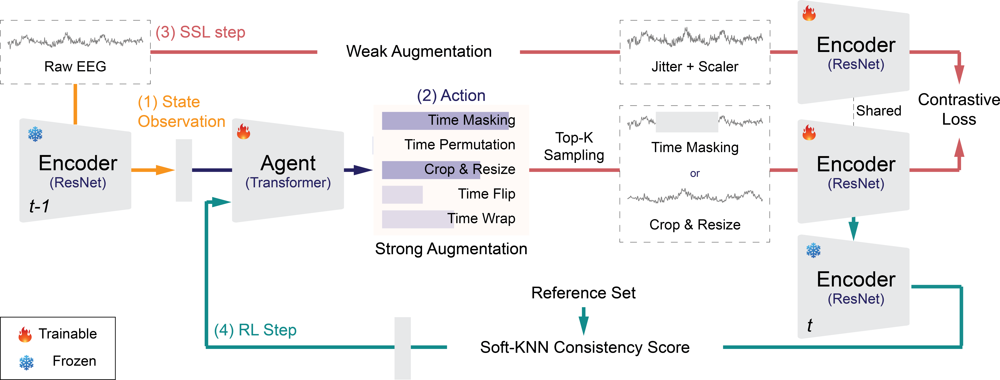

# RL-BioAug: Label-Efficient Reinforcement Learning for Self-Supervised EEG Representation Learning

> Under Review 

## Abstract
The quality of data augmentation serves as a critical determinant for the performance of contrastive learning in EEG tasks. Although this paradigm is promising for utilizing unlabeled data, static or random augmentation strategies often fail to preserve intrinsic information due to the non-stationarity of EEG signals where statistical properties change over time. To address this, we propose RL-BioAug, a framework that leverages a label-efficient reinforcement learning (RL) agent to autonomously determine optimal augmentation policies. While utilizing only a minimal fraction (10%) of labeled data to guide the agent's policy, our method enables the encoder to learn robust representations in a strictly self-supervised manner. Experimental results demonstrate that RL-BioAug significantly outperforms the random selection strategy, achieving substantial improvements of 9.69% and 8.80% in Macro-F1 score on the Sleep-EDFX and CHB-MIT datasets, respectively. Notably, this agent mainly chose optimal strategies for each task--for example, Time Masking with a 62% probability for sleep stage classification and Crop & Resize with a 77% probability for seizure detection. Our framework suggests its potential to replace conventional heuristic-based augmentations and establish a new autonomous paradigm for data augmentation.



## Table of Contents
- [Installation](#installation)
- [Project Structure](#project-structure)
- [Quick Start](#quick-start)
- [Data Preparation](#data-preparation)
- [Training](#training)
- [Evaluation](#evaluation)

## Installation
### Clone Repository

```bash
git clone https://github.com/your-username/RL-BioAug.git
cd RL-BioAug
```

## Project Structure
```
RL-BioAug/
├── main.py                    # Main training orchestrator (2-phase pipeline)
├── linear_probing.py          # Evaluation script for linear probing
├── configs/                   # Configuration files (YAML)
│   ├── sleep_edf_config_topk_*.yaml
│   ├── sleep_edf_linear_probing.yaml
│   ├── ptb_xl_config.yaml
│   └── sleep_edf_comparison.yaml
└── src/
    ├── main_search.py         # Phase 1: RL agent training
    ├── main_retrain.py        # Phase 2: SSL retraining with fixed agent
    ├── loss.py                # NT-Xent loss implementation
    ├── data/
    │   ├── dataset.py         # Dataset classes (SleepEDF, CHB-MIT)
    │   ├── sleep_edfx_parser.py
    │   └── chb_mit_parser.py
    ├── models/
    │   ├── resnet.py          # ResNet1D18 encoder
    │   └── policy.py          # ContextAgent (Transformer-based policy)
    └── transforms/
        └── augmentation.py    # Augmentation strategies
```


## Quick Start
### 1. Prepare Data
```bash
# Sleep-EDFX dataset
python src/data/sleep_edfx_parser.py \
    --data_dir /path/to/sleep-edfx-raw \
    --output_dir ./data/sleep-edfx/

# CHB-MIT dataset
python src/data/chb_mit_parser.py \
    --data_dir /path/to/chb-mit-raw \
    --output_dir ./data/chb-mit/
```

### 2. Train
```bash
python main.py --config configs/sleep_edf_config_topk_1.yaml --mode all
```

### 3. Evaluate
```bash
python linear_probing.py \
    --config configs/sleep_edf_linear_probing.yaml \
    --checkpoint_path checkpoints/experiment_id/final_encoder_retrained.pth
```


## Data Preparation
### Sleep-EDFX Dataset
Download from [PhysioNet Sleep-EDFX](https://physionet.org/content/sleep-edfx/1.0.0/)
```bash
python src/data/sleep_edfx_parser.py \
    --data_dir /path/to/sleep-edfx-raw \
    --output_dir ./data/sleep-edfx/
```

### CHB-MIT Seizure Dataset
Download from [PhysioNet CHB-MIT](https://physionet.org/content/chbmit/1.0.0/)
```bash
python src/data/chb_mit_parser.py \
    --data_dir /path/to/chb-mit-raw \
    --output_dir ./data/chb-mit/ \
    --chunk_duration 4.0
```

## Training
RL-BioAug uses a **two-phase training pipeline**:
### Phase 1: RL Agent Search
The RL agent learns optimal augmentation policies using KNN reward signals.
```bash
python main.py --config configs/sleep_edf_config_topk_1.yaml --mode search
```
### Phase 2: SSL Retraining
The encoder is retrained with the fixed (frozen) agent using NT-Xent loss.
```bash
python main.py --config configs/sleep_edf_config_topk_1.yaml --mode retrain
```
### Full Pipeline
Run both phases sequentially:
```bash
python main.py --config configs/sleep_edf_config_topk_1.yaml --mode all
```

## Evaluation
### Linear Probing
Evaluate the learned representations using linear probing:
```bash
python linear_probing.py \
    --config configs/sleep_edf_linear_probing.yaml \
    --checkpoint_path checkpoints/experiment_name/final_encoder_retrained.pth
```

## Citation
If you use this code in your research, please cite:
```bibtex
@article{lee2026rl,
  title={RL-BioAug: Label-Efficient Reinforcement Learning for Self-Supervised EEG Representation Learning},
  author={Lee, Cheol-Hui and Lee, Hwa-Yeon and Kim, Dong-Joo},
  journal={arXiv preprint arXiv:2601.13964},
  year={2026}
}
```


